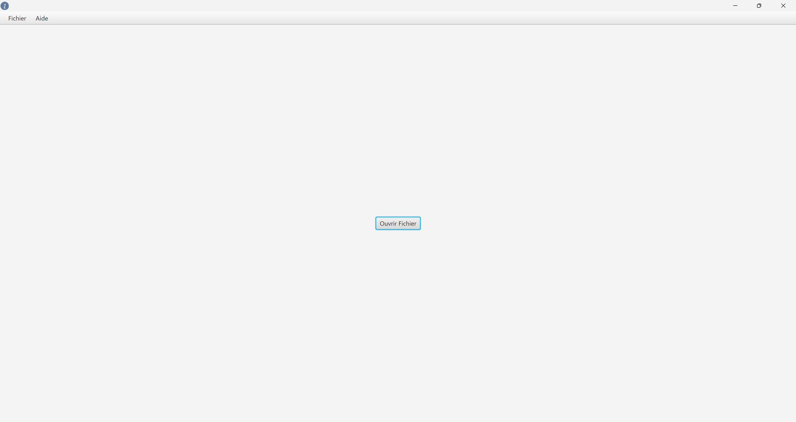
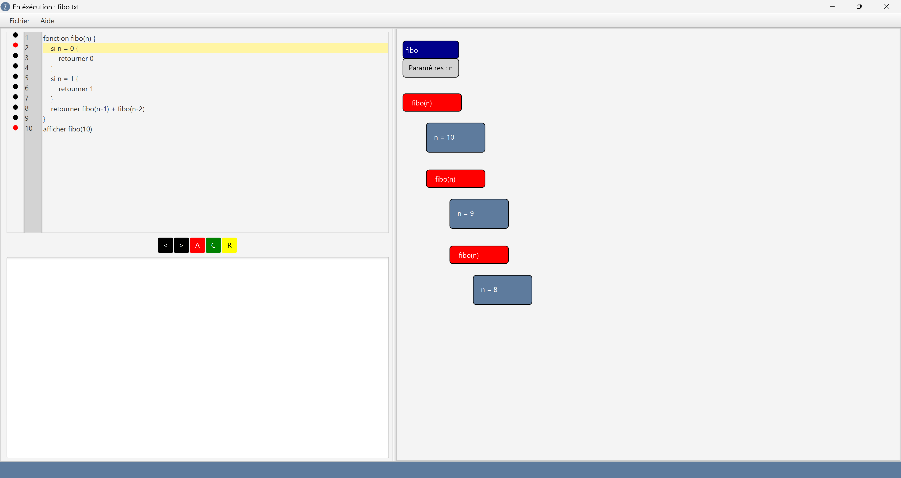
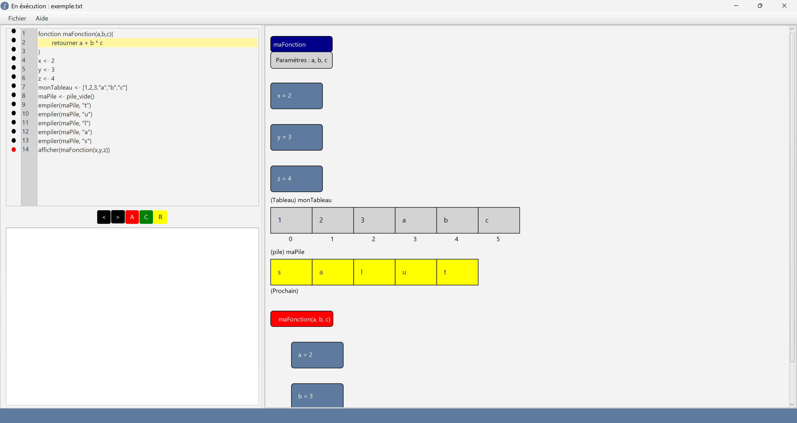

# L'Interpreteur Zorvex

**Version** : 1.0.0  

**Auteurs** : AHAMADA Houzaime, OJEDA Martin, NDOUR Mouhamed 

**Date de la dernière version** : 8 avril 2025

Sommaire :

- [Le langage Zorvex](#le-langage-zorvex)
- [Installation](#installation)
- [Interface](#interface)
- [Exemples de programmes](#exemples-de-programmes)

## Le langage Zorvex

### Généralités

Zorvex est un langage *impératif*, ayant une syntaxe proche de ce qui est usuellement considéré comme du pseudo-code.

Un **programme** en Zorvex est une suite d'**instructions**, une par ligne, séparées par des retours à la ligne. 

Les **instructions** correspondent à des calculs, des assignations ou des modifications portant sur des **variables**.

Une **variable** est la donnée d'un **identifiant** et d'une valeur associée. Un **identifiant** est une suite de caractère, un nom donnée à celle-ci. La valeur ainsi que le type donnés à une variable peut changer au cours de l'exécution du programme à l'aide de différentes instructions.

Toute **instruction** est basée sur l'évaluation d'une **expression**. Il s'agit d'un calcul mathématique mettant en oeuvre des **variables**, des constantes, ou des valeurs de retours d'**appels** de **fonctions** avec un certain nombre d'**arguments**.

Une **fonction** est une suite d'instructions particulière du programme. Elle possède des **paramètres** qui vont correspondre à des variables pouvant être utilisés lors de l'exécution de celle-ci. 

Les valeurs données à ces **paramètres** sont celles des **arguments** apparaissant au même nombre lors de l'appel de la fonction.

Lors d'un **appel** de fonction, les instructions la composant sont exécutées séquentiellement, jusqu'à ce qu'une instruction **retourner** soit rencontrée. Les variables définies à l'extérieur de l'appel de fonction ne sont pas accessibles lors de celui-ci.

L'**expression** evaluée par cette instruction va ainsi correspondre à la valeur de retour de l'appel.

### Types

Quatre **types** de variables existent en Zorvex.

- Les **nombres** : constitués uniquement d'entiers, positifs et négatifs, de `-2147483648` à `2147483647`
- Les **chaines de caractères**, délimitées par des guillements `"`.
- Les **tableaux dynamiques** : correspondent à ce qu'on appelle parfois listes dans différents langages. 
Supportent l'ajout et la suppression d'éléments. Définis par une suite de nombres, ou de chaines, sépraées par des virgules entre crochets `[]`.
- Les **piles** : une structure basée sur deux opérations : **empiler** et **dépiler**.

### Expression

Une expression est avant tout basée sur des opérations portant sur des **litéraux**. Cela inclut l'addition, la soustraction, la multiplication ou les comparaisons. En voici un exemple : `((5+2)*(7+3))/(10+12)`.

Un **litéral** est une constante d'un type donné.

Lorsqu'une expression met en jeu des types incompatibles, une **exception** est soulevée.

Exception (sans mauvais jeu de mot) faite des chaînes de caractères et de l'addition. Dans ce cas là, l'opération de concaténation est effctuée (en convertissant toutes les opérandes en chaîne de caractères).

De plus, les variables et les appels de fonctions sont des expressions. Ainsi, `(x+y)/5*z` est toujours une expression.

Les expressions sont évaluées suivant les règles de priorités usuelles des mathématiques.

Un appel de fonction prend la structure suivante, `nom_de_fonction(arg_1, arg_2, ..., arg_n)`, où les `arg_i` désignent les différents arguments de la fonction.

Si un identifiant apparaissant dans une expression n'est pas détecté, une **exception** est soulevée.

### Instructions

#### Assignation

L'instruction la plus importante en Zorvex est l'instruction d'assignation.

Elle prend la forme `identifiant <- expression`. Lors de son exécution, la variable `identifiant`, si elle n'existait pas déjà, est créée, et prend la valeur correspondant à l'évaluation d'`expression`.

#### Structures de contrôle

Il est parfois nécessaire pour le programmeur de pouvoir exécuter des instructions conditionnellement ou avec répétition. En Zorvex, cela peut être fait à l'aide des **structures de contrôles** qui sont au nombre de deux. 

L'expression associée à la **structure de contrôle** est appelée la **condition**. Si elle est vérifiée (son évaluation retourne un résultat non nul), les instructions d'un des blocs de la structure vont être exécutées.

##### Si-sinon

La structure de contrôle **si** permet d'exécuter un bloc d'instruction lorsqu'une condition est vérifiée.

Elle prend la forme 
```
si condition {
    <bloc d'instructions>
}
```
De plus, une instruction **si** peut posséder un bloc supplémentaire, un bloc **sinon** qui va correspondre à des instructions qui seront exécutées si la condition n'est **pas** vérifiée.

Cela prend la forme
```
si condition {
    <bloc d'instructions 1>
} sinon {
    <bloc d'instructions 2>
}
```

##### Tant que

Une boucle tant que est une autre structure de contrôle. Sa forme est assez simple.

```
tant que condition {
    <bloc>
}
```
Et comme on peut s'en douter, les instrutcions du bloc vont être exécutées tant que la condition n'est pas vérifiée.

#### Déclaration de fonction

Le dernier type d'instruction en Zorvex est la déclaration de fonction.

Elle prend la forme 
```
fonction nom_fonction(param1, param2, ..., paramn) {
    bloc d'instruction
}
```

où les `param_i` désignent les différents paramètres de la fonction.

### Fonctions-Instructions

Certaines fonctions sont déjà définies par Zorvex. Elles concernent les différentes structures de données.

Lorsqu'un des arguments n'est pas du type attendu, une **exception** est levée.

Les différentes structures de données ne peuvent seulement stocker des entiers ou des chaines de caractère.

#### Listes

- `ajouter_liste(liste, element)` ajoute l'élément `element` à la liste `liste`.
- `taille_liste(liste)` retourne le nombre d'éléments contenus dans la liste `liste`

Les trois instructions suivantes soulèvent une **exception** lorsque l'indice se trouve hors des bornes de la liste. Un indice valide est compris entre `0` et `taille_liste(liste)-1` inclus.

- `inserer_liste(liste, indice, element)` ajoute l'élément `element` en position `indice` dans la liste `liste`. 
- `suppprimer_liste(liste, indice)` supprime de la liste `liste` l'élément en position `indice`.
- `recuperer_liste(liste, indice)` retourne l'élément en position `indice` dans la liste `liste`.
- `modifier_liste(liste, indice, valeur)` remplace l'élément en position `indice` dans la liste `liste` par `valeur`.

#### Piles

- `pile_vide` retourne une pile vide.
- `empiler(pile, element)` ajoute en haut de la pile `pile`
l'élément `element`.
- `depiler(pile)` retourne l'élément se trouvant en haut de la pile `pile`, en le supprimant de celle-ci. Soulève une exception si la pile concernée est vide.

### Exceptions


## Installation

## Interface

L'interface de ZorvexInterpreter est interactive et ergonomique pour l'utilisateur. 

Après avoir installé et lancé le programme, une fenêtre vide avec un bouton au milieu s'affiche sur l'écran de l'ordinateur. 

Pour télécharger le fichier à interpréter, la procédure est simple :
Cliquez sur le bouton « Ouvrir Fichier »
Dans le navigateur de fichiers pop-up, allez dans le dossier du fichier que vous voulez télécharger.
Cliquez sur “sélectionner”

**Note :** Seuls les fichiers avec une extension .txt peuvent être téléchargés dans l'application. Assurez-vous que votre fichier possède cette extension.


<p style="text-align:center;">Scene pour charger un fichier</p>


Une fois le fichier chargé, une interface composée de trois cases vous est présentée. 
Dans le panneau de droite se trouve le canevas, qui est l'endroit où les éléments graphiques seront rendus après qu'une instruction l’indique.
Dans le panneau supérieur gauche se trouve le panneau d'instructions, où se trouve le programme chargé, avec un numéro de ligne attribué à chaque ligne, ainsi qu'un panneau de points d'arrêt 
Dans le panneau inférieur gauche se trouve la console, où seront affichés les résultats de sortie du programme (le cas échéant), ainsi que les éventuels messages d'erreur en cas d'exception. 

Vous pouvez ajouter un point d'arrêt sur n'importe quelle ligne du programme. Il vous suffit de cliquer sur le bouton noir situé à gauche de la ligne où vous souhaitez ajouter un point d'arret. Il deviendra rouge pour indiquer qu'il est activé. De même, si vous souhaitez supprimer un point d'arret à n'importe quel endroit du programme, vous pouvez sélectionner un point rouge qui deviendra noir pour indiquer qu'il est désactivé.

Une fois que vous avez défini les points d'arrêt souhaités, cliquez sur «Commencer» pour lancer l'exécution.

Si vous avez défini un point d'arrêt, le programme s'arrêtera à cette ligne et la mettra en évidence une fois son exécution terminée. Vous remarquerez que cinq boutons sont apparus au centre du panneau gauche de l'interface avec les légendes suivantes :

- “>” : Bouton pour avancer vers la prochaine instruction à être interprété (qui n’est pas forcément la ligne suivante). 
- “<” : Bouton pour revenir vers l’état précédent du programme avant l’exécution de la dernière ligne. 
- “A” : Bouton pour arrêter l’exécution du programme. Attention : Cette instruction efface le contenu du canevas. 
- “C” : Bouton pour continuer l'exécution du programme jusqu’à trouver un prochain point d'arrêt, ou jusqu’à la fin du programme. 
- “R” : Bouton pour recommencer l'exécution du programme


<p style="text-align:center;">Vue du programme arrêté dans un point d'arrêt</p>


Pendant l'exécution, en fonction du type d'instruction interprétée, une action différente sera effectuée sur le canevas. Par exemple, toute instruction d’assignation d’une valeur à un objet ou une variable déclenche le rendu de cet objet sur le canevas. De plus, la définition d’une fonction affichera un objet composé de deux encadrés bleu et gris, représentant le nom de la fonction et les paramètres qu’elle prend en entrée. Aussi, l’appel à une fonction avec des paramètres définis créera un objet similaire mais de couleur rouge, avec les variables affichant explicitement la valeur qu’elles contiennent (et leur évolution imminente).


<p style="text-align:center;">Différents rendus possibles sur le canevas</p>


Si une erreur est détectée pendant l'exécution du programme, celle-ci sera interrompue, et un message détaillé du type d’erreur sera envoyé via la console.

Pour consulter les informations sur le produit, cliquez sur le menu supérieur, dans la section « Aide », « A propos ». En outre, vous y trouverez les coordonnées des développeurs au cas où vous auriez trouvé des bugs ou des erreurs.

## Exemples de programmes
### Tri a bulles
    fonction tri_a_bulle(l) {
        i <- taille_liste(l)-1
        tant que i >= 1 {
            j <- 0
            tant que j < i {
                si recuperer_liste(l, j+1) < recuperer_liste(l, j) {
                    x <- recuperer_liste(l, j)
                    y <- recuperer_liste(l, j+1)
                    modifier_liste(l, j, y)
                    modifier_liste(l, j+1, x)
                }
                j <- j + 1
            }
            i <- i-1
        }
        retourner l
    }
